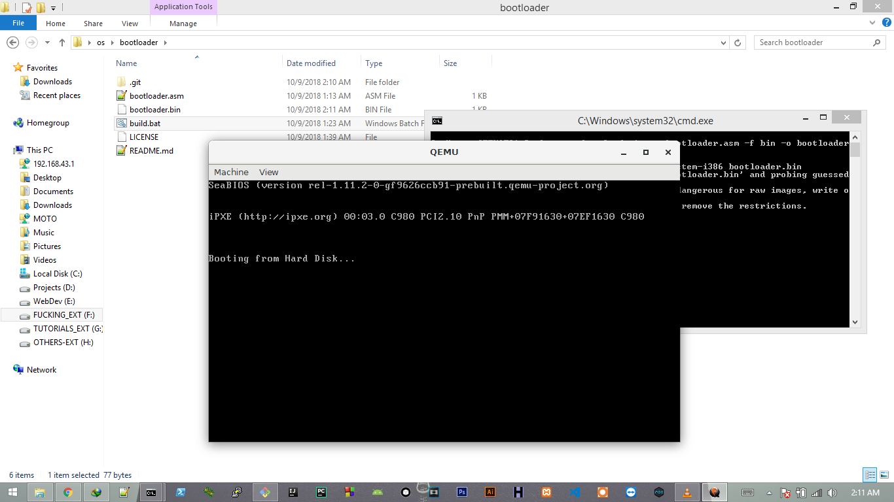
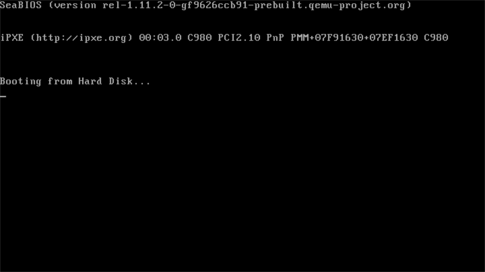

# Bootloader

The beginning of a customised OS from ground/source or whatever you may call.

## File Info

- bootloader.bin needs to be 512 bytes for now.

## Test

- Run `build.bat` to automatically assemble `bin` file and run with `qemu`.

## Images

## Tools Used

- [NASM](https://www.nasm.us/)
- [QEMU](https://qemu.weilnetz.de/)
- [HxD](https://mh-nexus.de/en/hxd/)

If host environment is windows,for best result add **NASM**(C:\Program Files\NASM) & **QEMU**(C:\Program Files\qemu;) to `path`

## Developers

- [chankruze](https://github.com/chankruze)
